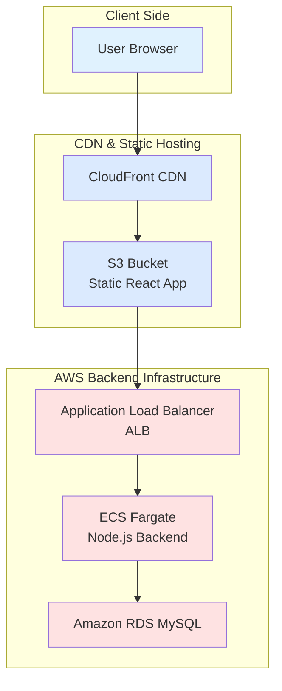
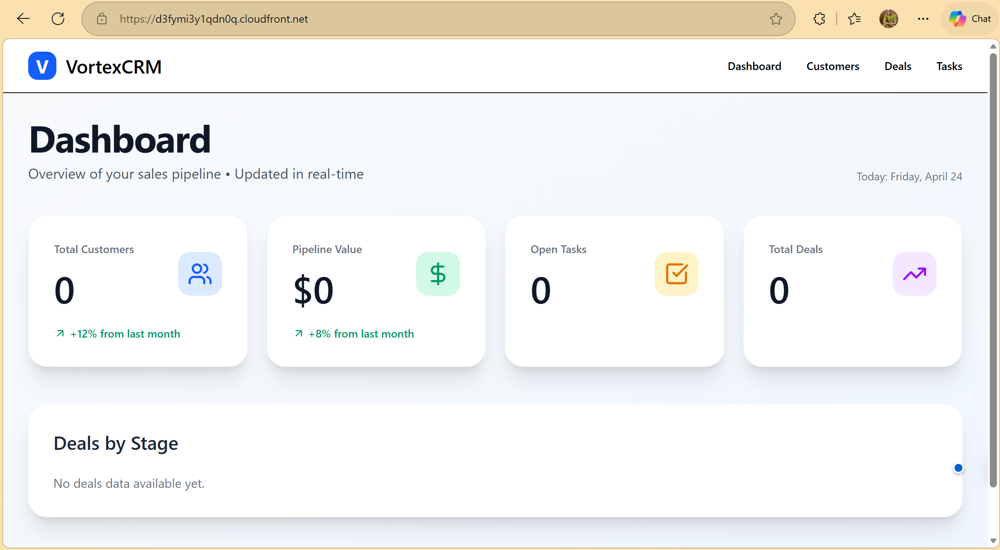
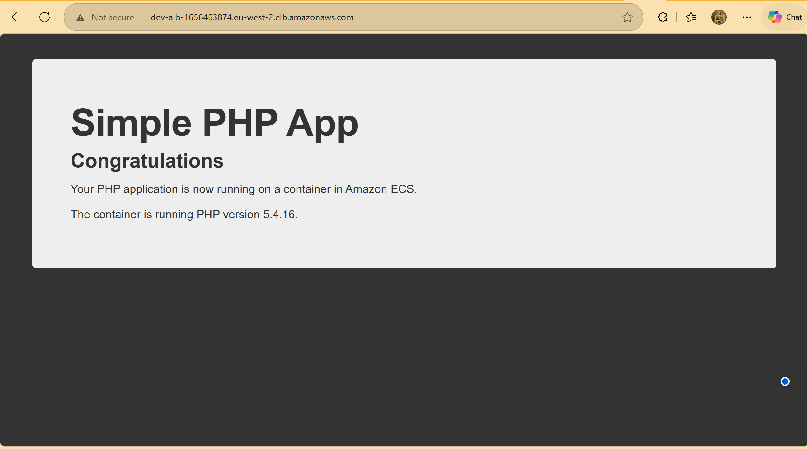

# VortexCRM

A full-stack Customer Relationship Management (CRM) application built with React + Node.js and deployed on AWS.

## Features
- Modern React frontend with Tailwind CSS
- REST API built with Node.js + Express
- MySQL database with sample data
- Deployed using Infrastructure as Code (AWS CloudFormation)
- Containerized backend on ECS Fargate
- Static frontend hosted on S3 + CloudFront

## Architecture


## Screenshots



## Tech Stack

Frontend: React 18 + Vite + TypeScript + Tailwind CSS
Backend: Node.js + Express + MySQL2
Infrastructure: AWS CloudFormation, ECS Fargate, RDS, S3, CloudFront
Containerization: Docker

## Project Structure
```
vortexcrm/
├── backend/           # Node.js API
├── frontend/          # React frontend
├── infrastructure/    # All CloudFormation templates
├── scripts/           # Helper scripts
└── README.md
```

## How to Run Locally
```bash
# 1. Clone the repository
git clone https://github.com/yourusername/vortexcrm.git
cd vortexcrm

# 2. Backend
cd backend
npm install
npm run dev

# 3. Frontend (in a new terminal)
cd frontend
npm install
npm run dev
```

## How to Deploy on AWS (IaC)
```bash
# Deploy in this order:

# 1. Networking (VPC)
aws cloudformation deploy \
  --template-file infrastructure/networking/vpc-stack.yaml \
  --stack-name vortexcrm-networking \
  --capabilities CAPABILITY_IAM

# 2. RDS (with init.sql via Lambda)
aws cloudformation deploy \
  --template-file infrastructure/rds/rds-stack.yaml \
  --stack-name vortexcrm-rds \
  --capabilities CAPABILITY_IAM

# 3. Backend (ECS Fargate)
aws cloudformation deploy \
  --template-file infrastructure/backend/ecs-fargate-stack.yaml \
  --stack-name vortexcrm-backend \
  --capabilities CAPABILITY_IAM

# 4. Frontend (S3 + CloudFront)
aws cloudformation deploy \
  --template-file infrastructure/frontend/s3-cloudfront-stack.yaml \
  --stack-name vortexcrm-frontend
```

## Teardown (Cleanup)
```bash
# Delete in reverse order
aws cloudformation delete-stack --stack-name vortexcrm-frontend
aws cloudformation delete-stack --stack-name vortexcrm-backend
aws cloudformation delete-stack --stack-name vortexcrm-rds
aws cloudformation delete-stack --stack-name vortexcrm-networking
```